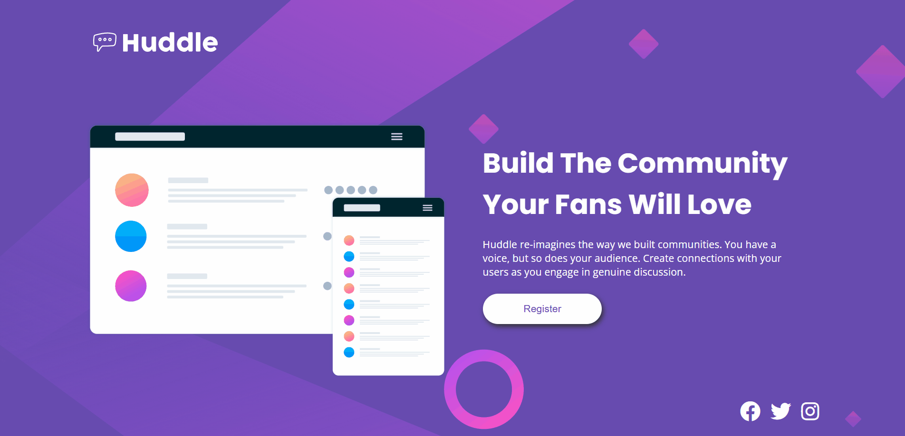
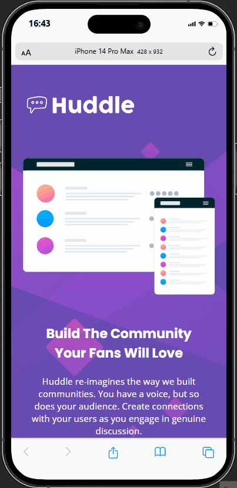

# Projeto exercicio Huddle landing page
Um projeto para pratica com css e html 🚀

## Funcionalidades ⚙️
- ✔️ - CSS: Para atribuir a estilização. Define layout, tipografia, cores e responsividade.
- ✔️ - HTML: Para atribuir a estruturação. Define a hierarquia dos elementos, organiza o conteúdo e dá forma à base do projeto.

## Tecnologias utilizadas 👨‍💻
- 🏗️ HTML
- 💅 CSS

## Preview 📷

### Modelo realizado:

- Desktop

[]

- Mobile

[]

## Estrutura de pastas 📂

```
src/
├── CSS/
│   ├── reset.css         
│   ├── responsive.css           
│   ├── styles.css 
│   └── variables.css      
├── design/             
└── images/      
index.html
README.md
style-guide.md                        
```

## Como executar 💪

1 - Clone o repositório:

```
git clone https://github.com/DuLean9/Huddle-landing-page.git
```
2 - Entre na pasta:

```
cd Huddle-landing-page
```

3 - Abra o VS Code:

```
code . 
```

## Demonstração 👁️
🔗 Acesse o projeto aqui: (https://dulean9.github.io/Huddle-landing-page/)
